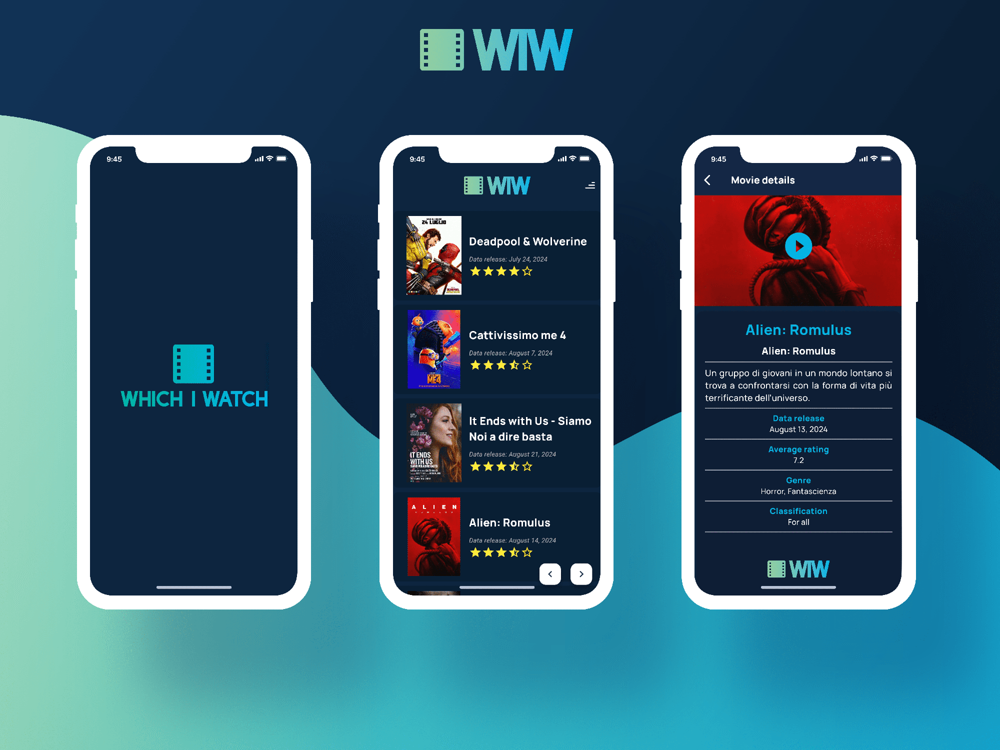

# Which I Watch (WIW): Your Personal Movie Guide 🎬



## 🌟 Overview

Which I Watch (WIW) is a mobile application developed with Flutter, designed for movie enthusiasts who want to explore, discover, and stay updated on the latest cinematic releases. With an intuitive user interface and convenient features, WIW is the perfect companion for your movie experience!

## 🚀 Key Features

- **Now Playing & Upcoming**: Browse a comprehensive list of movies currently in theaters and upcoming releases.
- **Visual Appeal**: Each movie is presented in an attractive card format, displaying the poster, title, and popularity rating.
- **Quick Popularity View**: Easily view a movie's popularity with our intuitive 5-star rating system, based on data provided by TMDB.
- **Custom Sorting**: Use the "Sort" button to arrange movies from most popular to least popular, helping you quickly find trending titles.
- **Simplified Navigation**: Conveniently explore the entire catalog with "Next" and "Previous" pagination arrows located at the bottom of the list.
- **Detailed Movie Information**: Access in-depth details for each movie, including:
  - Full title and subtitle (if available)
  - Official trailer video
  - Spoiler-free movie description
  - Release date
  - User ratings
  - Genre classification
- **User-Friendly Interface**: Smooth navigation and visually appealing design for an enhanced user experience.

## 🛠 Technologies Used

- **Flutter**: For efficient and high-performance cross-platform development.
- **Dart**: A powerful and flexible programming language.
- **TheMovieDB API**: To access a complete and up-to-date movie database.

## 🔧 Setup

To use WIW, you need to obtain an API key from TheMovieDB:

1. Sign up for free at [TheMovieDB Signup](https://www.themoviedb.org/signup).
2. Generate your personal API key.
3. Insert the key into the `lib/pages/api_key.dart` file:

```dart
const String apiKey = 'INSERT_YOUR_API_KEY_HERE';
```

## 🎨 Design & Development

Every aspect of Which I Watch, from the UI design to the WIW logo and code, was personally created and implemented to ensure a cohesive and unique user experience.

## 🙏 Credits

This application uses the TMDB API but is not endorsed or certified by TMDB.


This product uses the TMDB API but is not endorsed or certified by TMDB. We are grateful to [TMDB](https://www.themoviedb.org/) for providing the movie data that powers this app.

---

Developed with ❤️ by **Carlo Caruso**
